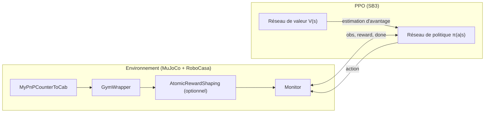
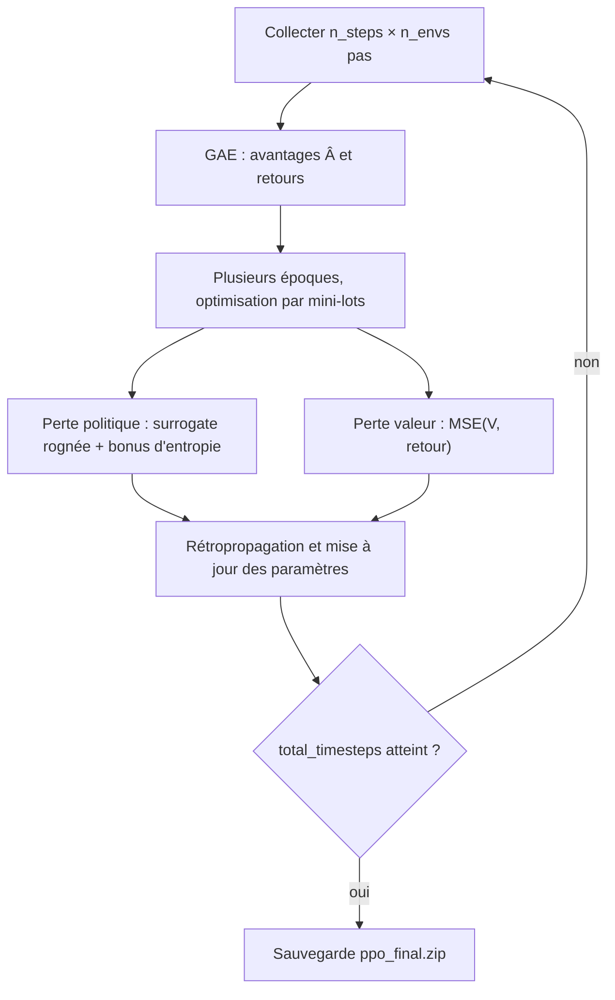

# Document de flux algorithmique (RoboCasa-RL · PPO)

Ce document décrit le flux bout en bout de l’apprentissage par renforcement pour une **tâche atomique** dans ce dépôt (par défaut `PnPCounterToCab`) : pile d’environnements, composition de la récompense, mises à jour PPO et évaluation. L’implémentation correspond principalement à `scripts/train_robocasa.py` et `scripts/eval_robocasa.py`.

---

## 1. Flux de données global

À chaque pas de contrôle :

1. L’agent obtient une action `action` à partir de l’observation courante `obs` (échantillonnage stochastique ou déterministe selon le mode).
2. L’environnement exécute `step(action)` et renvoie la nouvelle observation, une récompense scalaire, les indicateurs de fin d’épisode, etc.
3. PPO accumule les trajectoires en arrière-plan et, à intervalles fixes, estime les **avantages** avec **GAE** puis met à jour les réseaux de **politique** et de **valeur**.

---

## 2. Ordre d’empilement des environnements (de l’intérieur vers l’extérieur)

| Couche                          | Rôle                                                                                                                                           |
| ------------------------------- | ---------------------------------------------------------------------------------------------------------------------------------------------- |
| `MyPnPCounterToCab`             | Tâche atomique RoboCasa : plan de travail → placard ; simulation sous-jacente et critère de succès `_check_success()`.                         |
| `reset()` puis `GymWrapper`     | Initialiser la simulation avant d’exposer l’API Gymnasium (aligné sur le script d’entraînement, pour éviter des métadonnées robot non prêtes). |
| `AtomicRewardShapingWrapper`    | Optionnel : ajoute des termes denses à la récompense clairsemée de l’environnement (voir section suivante).                                    |
| `Monitor`                       | Enregistre la longueur d’épisode et le retour pour l’analyse des journaux.                                                                     |
| `DummyVecEnv` / `SubprocVecEnv` | Vectorisation parallèle ou multiprocessus pour la collecte par lots dans SB3.                                                                  |

---

## 3. Composition de la récompense

### 3.1 Couche basse (RoboCasa / `reward` personnalisé)

`MyPnPCounterToCab.reward()` renvoie actuellement `0` ; le succès de la tâche est défini par `_check_success()` (objet dans le placard et pince éloignée de l’objet). Pour retrouver le comportement RoboCasa par défaut, vous pouvez dans la sous-classe appeler la classe parente ou utiliser explicitement `float(_check_success())`.

### 3.2 Avec `--custom_reward_shaping` activé

Récompense totale à chaque pas :

R_t = r_{\text{sparse},t} + r_{\text{dense},t}

où `r_sparse` est la récompense scalaire reçue du niveau interne par le wrapper, et `r_dense` regroupe :

| Terme   | Signification                                                                                        | Poids / échelle par défaut |
| ------- | ---------------------------------------------------------------------------------------------------- | -------------------------- |
| reach   | Plus la distance effecteur–objet est faible, plus la récompense est élevée : `reach_w * exp(-4 * d)` | `reach_w=0.25`             |
| grasp   | Bonus constant si `check_obj_grasped` est vrai                                                       | `grasp_bonus=0.5`          |
| place   | Objet dans la zone du placard (`obj_inside_of(..., partial_check=True)`)                             | `place_bonus=1.0`          |
| success | `_check_success()` est vrai                                                                          | `success_bonus=5.0`        |

Le dictionnaire `info` contient aussi `sparse_reward` et `dense_reward` pour séparer les parties dense et clairsemée.

---

## 4. Flux algorithmique PPO (vue conceptuelle)

Le `PPO` de SB3 est un **acteur-critique** :

- **Réseau de politique π** : état en entrée, distribution sur les actions en sortie (en continu, souvent des paramètres gaussiens).
- **Réseau de valeur V** : état en entrée, estimation de la valeur d’état pour le calcul des avantages.

Une boucle de haut niveau dans un appel à `learn()` se résume ainsi :

Hyperparamètres liés à ce script (modifiables en CLI) :

- `n_steps` : nombre de pas collectés par environnement avant chaque mise à jour.
- `batch_size` : taille des mini-lots pendant l’optimisation.
- `learning_rate` : taux d’apprentissage.
- `total_timesteps` : plafond du nombre total d’interactions avec l’environnement.

---

## 5. Ordre d’exécution du script d’entraînement (`train_robocasa.py`)

1. Analyse des arguments (tâche, graine, nombre d’environnements parallèles, hyperparamètres PPO et shaping).
2. Pour chaque rang, construction de `make_env` : créer `MyPnPCounterToCab` → `reset` → `GymWrapper` → optionnel `AtomicRewardShapingWrapper` → `Monitor` → `reset(seed)`.
3. Encapsulation dans `DummyVecEnv` ou `SubprocVecEnv`.
4. Instanciation de `PPO(MlpPolicy, env, ...)`.
5. `model.learn(total_timesteps=...)`.
6. `model.save(.../ppo_final)` → fichier `ppo_final.zip` (politique, réseau de valeur, état d’entraînement, etc.).

---

## 6. Flux d’évaluation (`eval_robocasa.py`)

1. Construire la même tâche et `GymWrapper` que pour l’entraînement (`reset` avant l’enveloppe).
2. `PPO.load(model_path)`.
3. Pour chaque épisode : `reset` → boucle `predict(obs, deterministic=True)` → `step`, cumul du retour.
4. Compter les succès avec `_check_success()` de l’environnement interne.
5. Si `--save_video`, rendu hors écran multi-vues assemblé dans `eval_videos/<run_name>/`.

**Remarque** : si l’évaluation n’utilise pas le même `AtomicRewardShapingWrapper` que l’entraînement, les valeurs de retour ne sont pas directement comparables aux journaux d’entraînement avec récompense façonnée ; le taux de succès et le comportement restent régis par la dynamique de l’environnement et les poids de la politique.

---

## 7. Fichiers associés

| Fichier                            | Contenu                                                                            |
| ---------------------------------- | ---------------------------------------------------------------------------------- |
| `scripts/train_robocasa.py`        | Entraînement PPO, wrapper de récompense dense optionnel, environnements vectorisés |
| `scripts/eval_robocasa.py`         | Chargement du modèle, évaluation par épisodes, enregistrement vidéo optionnel      |
| `env/custom_pnp_counter_to_cab.py` | Environnement atomique personnalisé, mise en page et objets                        |
| `docs/ATOMIC_TASK_USAGE.md`        | Installation et utilisation en ligne de commande                                   |

---

## 8. Pour aller plus loin

- Stable-Baselines3 PPO : [documentation](https://stable-baselines3.readthedocs.io/en/master/modules/ppo.html)
- Article d’origine : Schulman et al., *Proximal Policy Optimization Algorithms* (2017)

